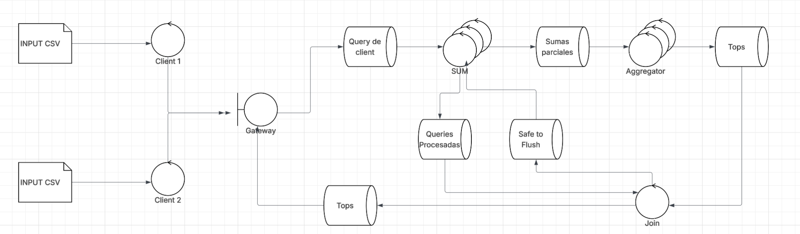

# Trabajo Práctico - Coordinación

En este trabajo se busca familiarizar a los estudiantes con los desafíos de la coordinación del trabajo y el control de la complejidad en sistemas distribuidos. Para tal fin se provee un esqueleto de un sistema de control de stock de una verdulería y un conjunto de escenarios de creciente grado de complejidad y distribución que demandarán mayor sofisticación en la comunicación de las partes involucradas.

## Ejecución

`make up` : Inicia los contenedores del sistema y comienza a seguir los logs de todos ellos en un solo flujo de salida.

`make down`:   Detiene los contenedores y libera los recursos asociados.

`make logs`: Sigue los logs de todos los contenedores en un solo flujo de salida.

`make test`: Inicia los contenedores del sistema, espera a que los clientes finalicen, compara los resultados con una ejecución serial y detiene los contenederes.

`make switch`: Permite alternar rápidamente entre los archivos de docker compose de los distintos escenarios provistos.

## Elementos del sistema objetivo

*Fig. 1: Diagrama de Robustez*

### Client

Lee un archivo de entrada y envía por TCP/IP pares (fruta, cantidad) al sistema.
Cuando finaliza el envío de datos, aguarda un top de pares (fruta, cantidad) y vuelca el resultado en un archivo de salida csv.
El criterio y tamaño del top dependen de la configuración del sistema. Por defecto se trata de un top 3 de frutas de acuerdo a la cantidad total almacenada.

### Gateway

Es el punto de entrada y salida del sistema. Intercambia mensajes con los clientes y las colas internas utilizando distintos protocolos.

### Sum
 
Recibe pares  (fruta, cantidad) y aplica la función Suma de la clase `FruitItem`. Por defecto esa suma es la canónica para los números enteros, ej:

`("manzana", 5) + ("manzana", 8) = ("manzana", 13)`

Pero su implementación podría modificarse.
Cuando se detecta el final de la ingesta de datos envía los pares (fruta, cantidad) totales a los Aggregators.

### Aggregator

Consolida los datos de las distintas instancias de Sum.
Cuando se detecta el final de la ingesta, se calcula un top parcial y se envía esa información al Joiner.

### Joiner

Recibe tops parciales de las instancias del Aggregator.
Cuando se detecta el final de la ingesta, se envía el top final hacia el gateway para ser entregado al cliente.

## Limitaciones del esqueleto provisto

La implementación base respeta la división de responsabilidades de los distintos controles y hace uso de la clase `FruitItem` como un elemento opaco, sin asumir la implementación de las funciones de Suma y Comparación.

No obstante, esta implementación no cubre los objetivos buscados tal y como es presentada. Entre sus falencias puede destactarse que:

 - No se implementa la interfaz del middleware. 
 - No se dividen los flujos de datos de los clientes más allá del Gateway, por lo que no se es capaz de resolver múltiples consultas concurrentemente.
 - No se implementan mecanismos de sincronización que permitan escalar los controles Sum y Aggregator. En particular:
   - Las instancias de Sum se dividen el trabajo, pero solo una de ellas recibe la notificación de finalización en la ingesta de datos.
   - Las instancias de Sum realizan _broadcast_ a todas las instancias de Aggregator, en lugar de agrupar los datos por algún criterio y evitar procesamiento redundante.
  - No se maneja la señal SIGTERM, con la salvedad de los clientes y el Gateway.

## Condiciones de Entrega

El código de este repositorio se agrupa en dos carpetas, una para Python y otra para Golang. Los estudiantes deberán elegir **sólo uno** de estos lenguajes y realizar una implementación que funcione correctamente ante cambios en la multiplicidad de los controles (archivo de docker compose), los archivos de entrada y las implementaciones de las funciones de Suma y Comparación del `FruitItem`.

*Fig. 2: Elementos mutables e inmutables*

A modo de referencia, en la *Figura 2* se marcan en tonos oscuros los elementos que los estudiantes no deben alterar y en tonos claros aquellos sobre los que tienen libertad de decisión.
Al momento de la evaluación y ejecución de las pruebas se **descartarán** o **reemplazarán** :

- Los archivos de entrada de la carpeta `datasets`.
- El archivo docker compose principal y los de la carpeta `scenarios`.
- Todos los archivos Dockerfile.
- Todo el código del cliente.
- Todo el código del gateway, salvo `message_handler`.
- La implementación del protocolo de comunicación externo y `FruitItem`.

Redactar un breve informe explicando el modo en que se coordinan las instancias de Sum y Aggregation, así como el modo en el que el sistema escala respecto a los clientes y a la cantidad de controles.

# Informe

Los cambios que introduje son los siguientes:
- Para manejar multiples clientes se le asigna un uuid a cada uno. El mismo se genera en el message handler. Ademas, se le asigna un numero incremental a cada query que hagan
- Para manejar multiples sum use la misma cola para el balanceo de carga. Lo que cambie es que cada vez que se procesa una query del cliente el ID de la misma se pasa al JOIN. Cuando llegue entonces el query de EOF de un cliente a cualquier SUM lo unico que va a hacer el nodo el pasarle el mensaje a JOIN. Como todas la queries de un cliente estan numeradas, el JOIN sabe cuantas queries mando un cliente antes del EOF. El Join ahora solo espera de tener todos los ids de las queries procesadas del cliente que mando el EOF. Una vez que tenga todo le manda un mensaje de safe to flush a todos los SUMs.
  - Aca detecte una mejora sustancial que intente implementar pero no logre hacer funcionar sin race conditions. En vez de que un SUM mande uno por uno los IDs de las queries procesadas, deberia mandar un bache. Esto ahorria bastantes mensajes y probablemente acelelaria el proceso ya que se reduciria la latencia de la red
- Para manejar varios Aggregators mantuve el exchange que se declaraba. Ahora cada entidad hace un hash de id del cliente y le hace un modulo de la cantidad de Aggregators que hay en el sistema. 
  - Aca tambien detecte una mejora. Se podria hacer que las queries de un cliente esten repartidas entre varios Aggregators y que luego JOIN se encargue de fucionar los tops parciales. Eso aceleraria bastante el proceso. Llegue a tener una implementacion casi completa de esta solucion, pero estaba teniendo race conditions que no logre dilucidar el por que. Si hubiese tenido mas tiempo hubiese hecho una implementacion muy similar a la de SUM (usar una queue en vez de un excahge) y que JOIN se encargue de coordinar.

Con la implementacion actual el sistema escala mucho en cuanto a la cantidad de clientes que pueden ser atendidos. Ahora el trabajo se reparte de forma uniforme entre los SUMs. Los Aggregators tienen el margen de mejora antes explicado, pero igualmente se ve una mejora sustancial frente al caso en el que haya un solo Aggregator. Sobre todo si se aumenta la cantidad de computo que deberian hacer, ya que se vera repartida de cierta forma. De vuelta, podria ser repartida de forma mas uniforme, pero igualmente hay una mejora frente al caso de un solo Aggregator  